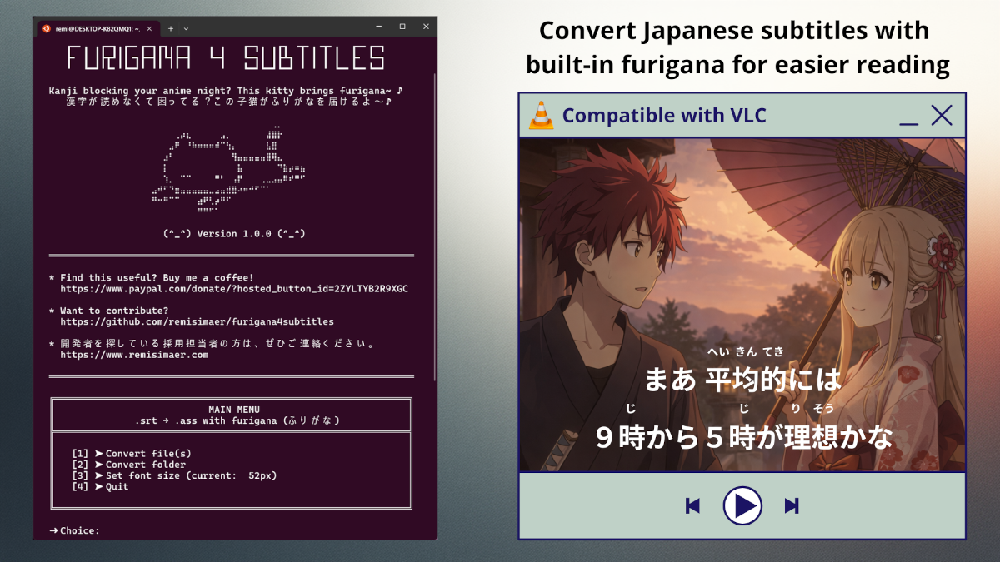

# Furigana4Subtitles



Convert Japanese subtitle files .srt to .ass format with furigana (reading aids) displayed above kanji characters.

Unlike most subtitle solutions that rely on ruby annotations (which don’t work properly in VLC), this tool uses a different technique, making the subtitles fully compatible with VLC.

## Prerequisites

### Windows
For Windows, please install [WSL2](https://learn.microsoft.com/en-us/windows/wsl/install) and follow GNU/Linux installation steps. 

Make sure you have installed WSL version 2.

### macOS
I don't have a Mac so don't hesitate to contribute to the project.

### GNU/Linux & Windows
Adapt the commands to your WSL2 / distribution.

#### Install Mecab
```bash
sudo apt update
sudo apt install mecab libmecab-dev mecab-ipadic-utf8 pkg-config
```

## Usage

### Compile
```bash
make
```

#### Convert subtitles
#### Commands
| Action | Command |
|--------|---------|
| Single file | `./furigana4subtitles "subtitle.srt"` |
| Multiple files | `./furigana4subtitles "file1.srt" "file2.srt" "file3.srt"` |
| All files from a folder | `./furigana4subtitles ./folder1/` |
| Multiple folders | `./furigana4subtitles ./folder1/ ./folder2/` |
| Mix folders and files | `./furigana4subtitles ./folder1/ "file1.srt" ./folder2/` |

### Interactive CLI version
```bash
./furigana4subtitles-cli
```
- **Option 1**: Convert one or more `.srt` files by entering their paths
- **Option 2**: Recursively convert all `.srt` files in a folder

## Output
The program generates `.ass` files in the same directory as the input files:
- `/path/to/subtitle.srt` → `/path/to/subtitle.ass`

## License
GNU General Public License v3.0 or later

## Author
Rémi SIMAER <rsimaer@gmail.com>
